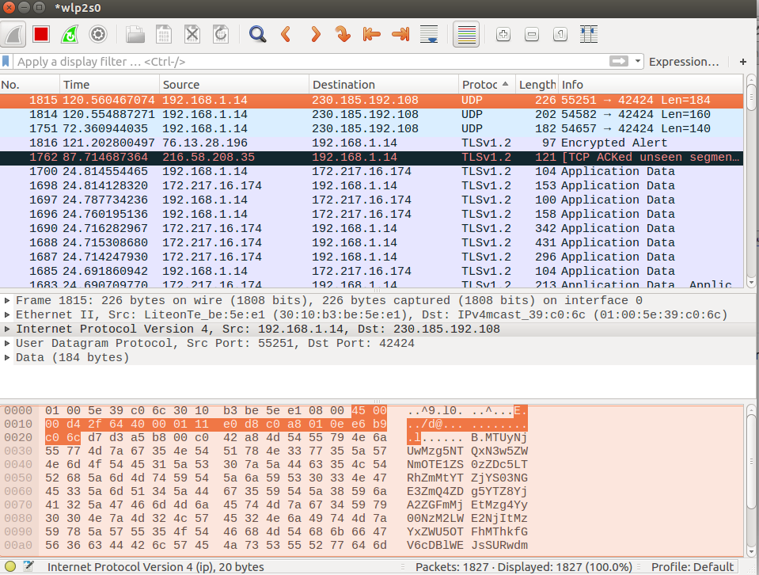
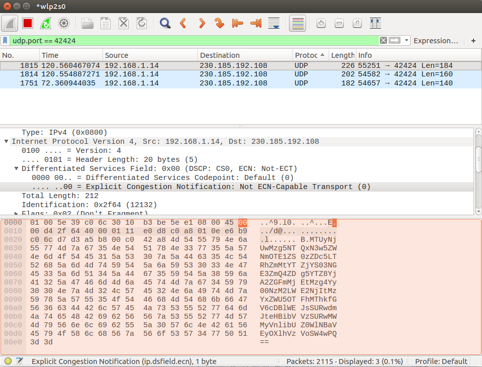

# Laboratory work 6 - tasks implementation

##Algorithm of work:
1. Wireshark application has been stared;
2. Open 2 instances of Application: Corina and Corina-Instance-2;
3. As there are more than 1 application running on the Computer, which make use of Internet, in the wireshark are displayed multiple transmitted packages(img1.png) .
**4.Applicatoin Package indetification**  
In order to filter the packages the data was filtered according to `udp.port == 42424`, as the application is running in UDP, port-42424 ;

**5. Analyzis of received/send data** 
Studying a little bit the Chat-Application, had been identified 2 types of 'actions': Login or Connecting to the Chat, and Sending a message, that's why we will have to study 2 types/structures of packages.

**6. Structure 1: Login(Connecting) to the Chat package** 
Package structure is presented in figure (img4.png).
This is the sent package content. On the left side we have hexa-decimal representation of the package content, on the right we have the data in Ascii representation. In fact this is the transmitted data encoded in Base64.
-The ASCII 'text' had been coppied, and converted through a Hex-to-String converter.  
Coppied data:
[01005e39c06c3010b3be5ee10800450000a8250640000111eb62c0a8010ee6b9c06cd581a5b800944e624d5455794e6a55774d7a67304e7a45354d6e77355a574e6d4f5445315a53307a5a4463354c5452685a6d4d7459545a6a595330334e4745335a6d51345a44673559545a384f6d46736248786c656e41775a56684362456c4563485a6962586877596d315663306c456344466a4d6c5a35596d31476446705451576c524d6a6c355956633161456c754d44303d]
 
Converted: 
[^9Àl0³¾^áE¨%@ëbÀ¨æ¹ÀlՁ¥¸”NbMTUyNjUwMzg0NzE5Mnw5ZWNmOTE1ZS0zZDc5LTRhZmMtYTZjYS03NGE3ZmQ4ZDg5YTZ8OmFsbHxlenAwZVhCbElEcHZibXhwYm1Vc0lEcDFjMlZ5Ym1GdFpTQWlRMjl5YVc1aEluMD0=]
 
Base64 Decoded:
[]nS[1526503847192|9ecf915e-3d79-4afc-a6ca-74a7fd8d89a6|:all|ezp0eXBlIDpvbmxpbmUsIDp1c2VybmFtZSAiQ29yaW5hIn0=]
 
6.1. `1526503847192`-  Time from miliseconds: Wed May 16 2018 23:50:47 
6.2. `9ecf915e-3d79-4afc-a6ca-74a7fd8d89a6` - UUID assigned to the logged user. This UUID will be used later so it is important to understand what it is for. 
6.3. `:all` - This field is a filter to tell the program that the packet he received needs to be broadcasted to all the users connected to the application-server. 
6.4. `ezp0eXBlIDpvbmxpbmUsIDp1c2VybmFtZSAiQ29yaW5hIn0=` - this is another Base64 encoded string. 
Decoded value: `{:type :online, :username "Corina"}`. 

**7. Sending a package, to trick server that another user connects to the application.** 
7.1. Initial value - `{:type :online, :username "Corina-Tricky-User"}`  
Base64 Encoded - `ezp0eXBlIDpvbmxpbmUsIDp1c2VybmFtZSAiQ29yaW5hLVRyaWNreS1Vc2VyIn0=`
7.2. Based on the studied package structure, has been created a new package. 
-Current time has been generated to milliseconds. 
-the previous UUID has been modified as UUID must be Unique for each user. 
New Package Content-[1526506107098|7abf915e-3d79-4afc-a6ca-74a7fd8d89a6|:all|ezp0eXBlIDpvbmxpbmUsIDp1c2VybmFtZSAiQ29yaW5hLVRyaWNreS1Vc2VyIn0=] 
7.3. Encode to Base64 the package content - [MTUyNjUwNjEwNzA5OHw3YWJmOTE1ZS0zZDc5LTRhZmMtYTZjYS03NGE3ZmQ4ZDg5YTZ8OmFsbHxlenAwZVhCbElEcHZibXhwYm1Vc0lEcDFjMlZ5Ym1GdFpTQWlRMjl5YVc1aExWUnlhV05yZVMxVmMyVnlJbjA9] 
7.4. The package has been sent using PacketSender app. Data like: IP and Port had been retrieved from wireshark. 
7.5. The Tricky user had appeared in the chat. Moreover 3 new packages had appeared in the wireskark. Why 3? (1- the message of connection to the server, 2- two broadcasted messages to the users from the chat: Corina and Corina-Instance-2, In order to annouce them that there is a new user in the chat!) 

**8. Structure 2: Message sending package** 
Once a message is sent in the chat, has been observed that 2 new packages appeared in the wireshark. 
8.1. Package with the message that was sent 
Decode Value - [1526506863193|b06daf21-388c-4736-a662-361ee991a18d|9ecf915e-3d79-4afc-a6ca-74a7fd8d89a6|ezp0eXBlIDpjaGF0LCA6dHh0ICJCdW5hIHNlYXJhISJ9] 
Content - [{:type :chat, :txt "Buna seara!"}] 

8.2.Package with the aknowledgement message that was sent 
Decode Value - [1526506863199|9ecf915e-3d79-4afc-a6ca-74a7fd8d89a6|b06daf21-388c-4736-a662-361ee991a18d|ezp0eXBlIDpkZWxpdmVyZWR9] 
Content - [{:type :delivered}].

**9. Sending message from the fake create user** 

9.1. Encoding the text message : [{:type :chat, :txt "Hey you, this is a messag from the triky user!"}]  
9.2. Encoded in Base64 : [ezp0eXBlIDpjaGF0LCA6dHh0ICJIZXkgeW91LCB0aGlzIGlzIGEgbWVzc2FnIGZyb20gdGhlIHRyaWt5IHVzZXIhIn0=] 
9.3. UUID of the fake user : [7abf915e-3d79-4afc-a6ca-74a7fd8d89a6] 
9.4. Finding a UUID for to who send the message, we will use the UUID of the first user we created : [9ecf915e-3d79-4afc-a6ca-74a7fd8d89a6] 
9.5. New Built Message : [1526507747175|9ecf915e-3d79-4afc-a6ca-74a7fd8d89a6|b0662059-d19d-4943-b4c9-b376b1e4f6be|ezp0eXBlIDpjaGF0LCA6dHh0ICJIZXkgeW91LCB0aGlzIGlzIGEgbWVzc2FnIGZyb20gdGhlIHRyaWt5IHVzZXIhIn0=] 
9.6.Ecoded in Base64 :[MTUyNjUwNzc0NzE3NXw5ZWNmOTE1ZS0zZDc5LTRhZmMtYTZjYS03NGE3ZmQ4ZDg5YTZ8YjA2NjIwNTktZDE5ZC00OTQzLWI0YzktYjM3NmIxZTRmNmJlfGV6cDBlWEJsSURwamFHRjBMQ0E2ZEhoMElDSklaWGtnZVc5MUxDQjBhR2x6SUdseklHRWdiV1Z6YzJGbklHWnliMjBnZEdobElIUnlhV3Q1SUhWelpYSWhJbjA9]  
9.7.Sengind message to the user using Packet Sender.

